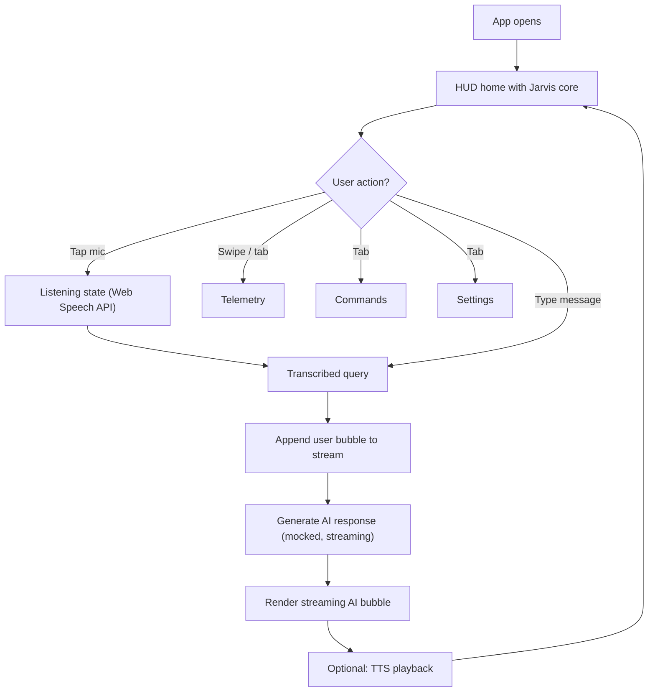

# Mobile Jarvis — Product Requirements Document

## 1. Product Overview

Mobile Jarvis is a mobile-first AI assistant web app inspired by the J.A.R.V.I.S. interface from Iron Man. It delivers a futuristic holographic HUD where the user talks to (or types to) a personal AI, sees real-time system telemetry, and triggers quick commands — all optimized for touch on a phone screen.

- **Primary purpose**: provide a fast, beautiful, voice-driven AI assistant on mobile devices.
- **Target users**: tech enthusiasts, productivity users, sci-fi fans, developers who want a quick conversational interface.
- **Value**: turns the phone into a "command deck" — a single screen with a living AI core, conversation, telemetry, and tools.

## 2. Core Features

### 2.1 User Roles
Not applicable — single-user, local-only app. No authentication.

### 2.2 Feature Modules
1. **HUD Home** — Animated Jarvis core (SVG arcs + particles), greeting, status, current mission/tip.
2. **Chat / Conversation** — Streaming AI responses, voice input (Web Speech API), voice output (TTS), message history, copy/replay.
3. **Telemetry** — Live system vitals (CPU, memory, network, battery, uptime), sparkline charts, module health indicators.
4. **Command Palette** — Tap-to-run quick actions (Lights, Music, Weather, Schedule, Scan, Lock) with simulated responses.
5. **Settings Drawer** — Voice toggle, theme density, persona name, reset history, haptic feedback toggle.

### 2.3 Page Details

| Page Name | Module Name | Feature Description |
|-----------|-------------|---------------------|
| HUD Home | Jarvis Core | Central animated circular HUD with rotating arcs, pulsing core, status text. Tap to greet; long-press to enter "listening" mode. |
| HUD Home | Mission Feed | Auto-rotating "mission tips" and time/date/battery strip. |
| Chat | Message Stream | Streaming text response (character-by-character) with terminal cursor, user/AI bubbles, timestamps. |
| Chat | Voice Orb | Bottom-center mic button with waveform animation; tap-and-hold to record, release to send. |
| Telemetry | Vitals Cards | 4 small cards: CPU %, MEM %, NET MB/s, BATT % — each with mini sparkline. |
| Telemetry | Module Roster | List of subsystems (Voice, Vision, Network, Memory) with health dot and last-check timestamp. |
| Commands | Quick Actions | 3x2 grid of command cards with icon, label, simulated side-effect animation. |
| Settings | Preferences | Toggles, slider, persona input, reset button. |

## 3. Core Process

## 4. User Interface Design

### 4.1 Design Style
- **Aesthetic direction**: "Iron Man HUD" — futuristic, technical, cyan-on-dark, with thin neon strokes, scan lines, and a holographic atmosphere. Editorial/sci-fi rather than friendly.
- **Color palette**:
  - Background: deep space black `#02060B` with subtle radial gradient to `#06121B`
  - Primary neon: cyan `#22E0FF`
  - Secondary neon: ice blue `#7AB8FF`
  - Accent: warm amber `#FFB347` (for warnings / AI speaking state)
  - Critical: red `#FF4D6D` (used sparingly for alerts)
  - Text: cool white `#D7F3FF` / muted `#5B7A91`
- **Typography**:
  - Display / Headings: **Orbitron** (700) — geometric sci-fi feel
  - Mono / data readouts: **JetBrains Mono** (400/500) — terminal vibe
  - Body: **Inter** (400/500) — for chat content readability
- **Component style**:
  - Thin 1px neon borders with subtle inner glow (`box-shadow: 0 0 12px rgba(34,224,255,.35)`)
  - Hexagonal / chamfered corners using `clip-path: polygon(...)`
  - Scanline overlay (CSS repeating linear gradient, low opacity)
  - Number tickers, bracketed labels `[CORE]`, `> STATUS: ONLINE`
- **Icon style**: Lucide icons in 1.5px stroke, glowing cyan.
- **Layout**: Mobile-first (375–430px reference), full-bleed dark canvas, glass HUD panels with backdrop-blur, no card-shadows relying on default Tailwind defaults.

### 4.2 Page Design Overview

| Page Name | Module Name | UI Elements |
|-----------|-------------|-------------|
| HUD Home | Jarvis Core | 280px SVG with 3 concentric arcs, rotating at different speeds; central 60px glowing orb; hex clip; ambient particles. |
| HUD Home | Top Strip | Time, date, battery icon, network signal bars — JetBrains Mono 12px, cyan. |
| HUD Home | Mission Feed | Single line of text that crossfades between tips every 4s. |
| Chat | Stream | Vertical scroll, alternating left/right bubbles; AI bubble has a left "core dot"; user bubble has timestamp on right. |
| Chat | Voice Orb | 72px circle with animated waveform (5 bars scaling with audio level). |
| Telemetry | Vitals Cards | 2x2 grid, each 160x110px, label + value + 60x20 sparkline. |
| Telemetry | Module Roster | List rows with status dot (pulsing), module name, last-check in mono. |
| Commands | Grid | 2x3 grid, square cards 150x150px, icon at top, label below, glow on tap. |
| Settings | Rows | Full-width rows with label on left, control on right, 1px divider. |

### 4.3 Responsiveness
- **Mobile-first** (primary target 360–430px wide).
- Tablet (>768px): keep portrait layout, expand telemetry cards to 4-up.
- Desktop (>1024px): cap content at 480px width, center, with side decorative ambient arcs.
- Touch targets: minimum 44x44px.
- Safe-area padding for notch (`env(safe-area-inset-top/bottom)`).

### 4.4 3D / Motion Guidance
- No 3D. Motion is CSS/SVG only.
- **Page load**: arcs rotate in (0–360deg) staggered 0/200/400ms; orb fades in + scales from .6 → 1.
- **Listening state**: outer arcs accelerate to 2x speed; orb pulses amber.
- **AI speaking**: typing dots inside bubble; orb pulses cyan.
- **Tab switch**: panels slide horizontally with 200ms cubic-bezier(.2,.8,.2,1).
- **Ambient**: slow scanline drift (8s loop), low-opacity particles floating upward (12s).
- **Performance**: respect `prefers-reduced-motion`.

## 5. Out of Scope (v1)
- Real LLM integration (uses a deterministic mock that streams a curated response).
- Persistence to a backend (chat history kept in localStorage).
- Authentication.
- Push notifications.
