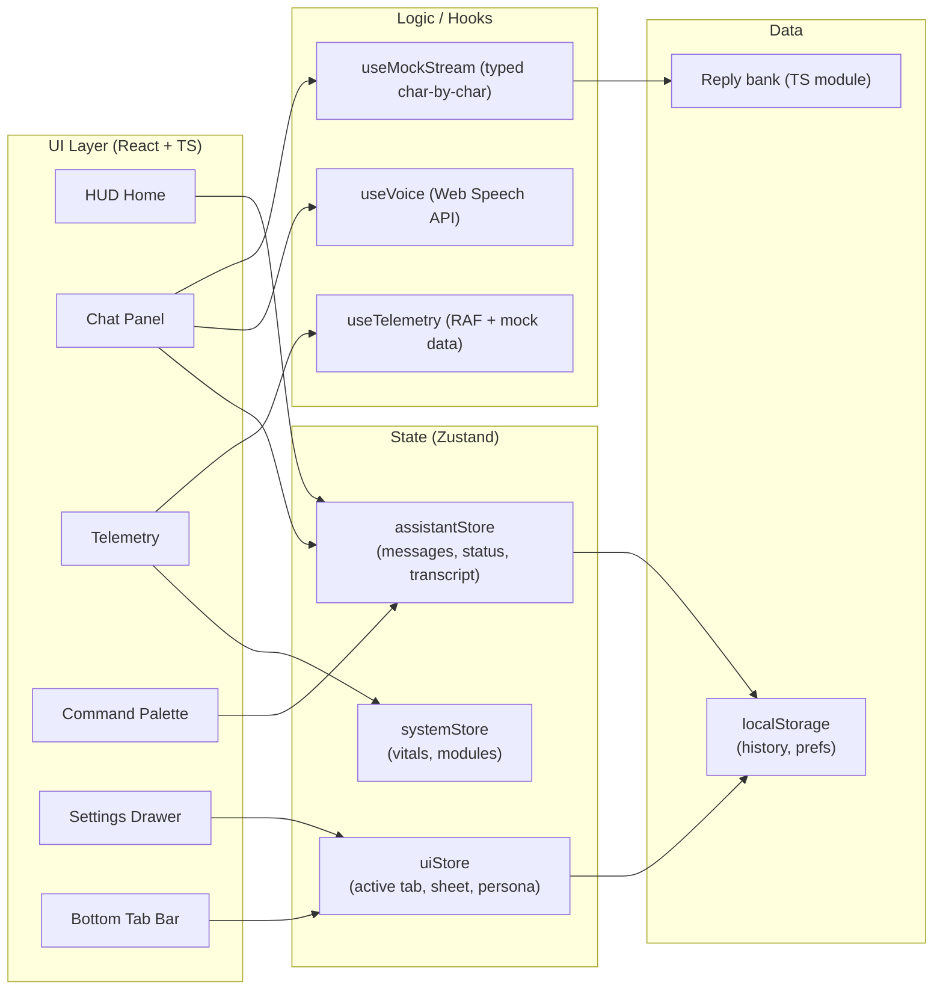
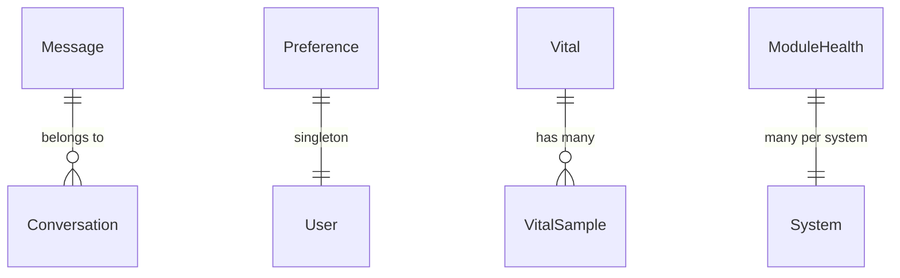

# Mobile Jarvis — Technical Architecture

## 1. Architecture Design



Pure frontend. No backend. No external services. Runs fully from static files.

## 2. Technology Description

- **Frontend**: React@18 + TypeScript + Vite@5
- **Styling**: Tailwind CSS@3 (custom theme tokens for cyan neon palette)
- **State**: Zustand@4
- **Icons**: lucide-react
- **Fonts**: Orbitron, JetBrains Mono, Inter (self-hosted via @fontsource)
- **Voice**: Web Speech API (`SpeechRecognition` + `speechSynthesis`) — no third-party SDK
- **Animations**: CSS keyframes + Tailwind transitions; no animation library required
- **Package manager**: npm (no pnpm detected in env)
- **Initialization**: `npm init vite@latest . -- --template react-ts`

## 3. Route Definitions

Single-page app, no router required. Tab state in `uiStore`.

| View (tab) | Purpose |
|------------|---------|
| `home` | HUD with Jarvis core, mission feed, voice orb |
| `chat` | Conversation stream with message history |
| `telemetry` | System vitals + module roster |
| `commands` | Quick action grid |
| `settings` | Preferences drawer |

## 4. API Definitions

No HTTP API. All "AI" responses come from a local reply bank streamed via `setInterval` to simulate tokens.

### Internal types (TypeScript)

```ts
export type Role = "user" | "assistant" | "system";
export interface Message {
  id: string;
  role: Role;
  content: string;
  createdAt: number;
  pending?: boolean;
}
export type AssistantStatus = "idle" | "listening" | "thinking" | "speaking";
export interface VitalSample { t: number; v: number }
export interface Vital { key: string; label: string; unit: string; value: number; series: VitalSample[] }
export interface ModuleHealth { id: string; name: string; status: "online" | "degraded" | "offline"; lastCheck: number }
export interface Command { id: string; label: string; icon: string; response: string }
```

## 5. Server Architecture Diagram

Not applicable — no backend.

## 6. Data Model

Data model is in-memory + localStorage. No SQL.

### 6.1 Model Definition (logical)



### 6.2 Storage Definition

`localStorage` keys:

| Key | Type | Purpose |
|-----|------|---------|
| `jarvis.history` | `Message[]` | Persisted chat history (last 200) |
| `jarvis.prefs` | `{ personaName: string; voice: boolean; haptics: boolean; density: 'compact'\|'comfortable' }` | User preferences |

## 7. Project Structure

```
jarvis-mobile/
├─ index.html
├─ package.json
├─ tsconfig.json
├─ vite.config.ts
├─ tailwind.config.js
├─ postcss.config.js
└─ src/
   ├─ main.tsx
   ├─ App.tsx
   ├─ index.css
   ├─ components/
   │  ├─ JarvisCore.tsx
   │  ├─ TopStrip.tsx
   │  ├─ MissionFeed.tsx
   │  ├─ VoiceOrb.tsx
   │  ├─ ChatStream.tsx
   │  ├─ MessageBubble.tsx
   │  ├─ VitalsCard.tsx
   │  ├─ Sparkline.tsx
   │  ├─ ModuleRoster.tsx
   │  ├─ CommandGrid.tsx
   │  ├─ SettingsPanel.tsx
   │  ├─ BottomNav.tsx
   │  ├─ ScanlineOverlay.tsx
   │  └─ HexPanel.tsx
   ├─ hooks/
   │  ├─ useVoice.ts
   │  ├─ useMockStream.ts
   │  └─ useTelemetry.ts
   ├─ stores/
   │  ├─ assistant.ts
   │  ├─ system.ts
   │  └─ ui.ts
   ├─ data/
   │  ├─ replies.ts
   │  └─ commands.ts
   └─ utils/
      └─ format.ts
```

## 8. Performance & Accessibility

- Memoize sparkline drawing on a single `<canvas>` to avoid layout thrash.
- Use `requestAnimationFrame` for telemetry updates; throttle to 4 Hz.
- `prefers-reduced-motion` disables ambient animations.
- Color contrast on body text ≥ 4.5:1 against the dark background.
- All interactive controls have visible focus rings (cyan).
- Voice features gracefully no-op if API is unavailable.
